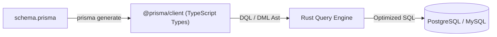
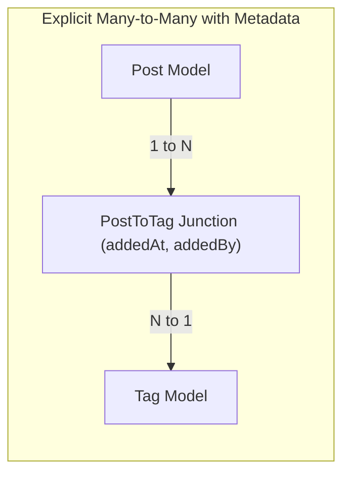
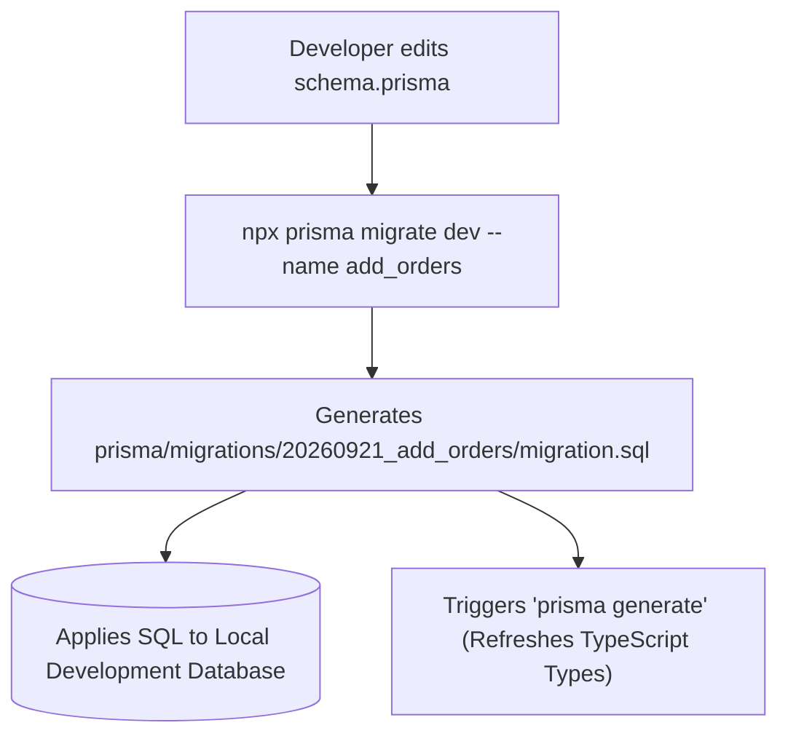

# Learn Prisma ORM: From Zero to Staff Database Architect

[]()
[]()
[](LICENSE)

> A masterclass on Prisma ORM schema modeling, Rust Query Engine internals, relation mechanics, interactive transactions, Prisma Client `$extends`, zero-downtime migrations, and enterprise database performance.

---

## Table of Contents
1. [Stage 1: Absolute Beginner Foundations & The Prisma Engine Architecture](#1-stage-1-absolute-beginner-foundations--the-prisma-engine-architecture)
2. [Stage 2: Schema DSL, Data Modeling, Types & Relation Invariants](#2-stage-2-schema-dsl-data-modeling-types--relation-invariants)
3. [Stage 3: Prisma Client CRUD, Nested Writes & High-Throughput Querying](#3-stage-3-prisma-client-crud-nested-writes--high-throughput-querying)
4. [Stage 4: Transactions, Concurrency & Optimistic Locking](#4-stage-4-transactions-concurrency--optimistic-locking)
5. [Stage 5: Prisma Migrate, Prototyping & Database Introspection](#5-stage-5-prisma-migrate-prototyping--database-introspection)
6. [Stage 6: Client Extensions (`$extends`), Middleware & Connection Pooling](#6-stage-6-client-extensions-extends-middleware--connection-pooling)
7. [Stage 7: Staff Database Architect Interview Handbook & Production Cheatsheet](#7-stage-7-staff-database-architect-interview-handbook--production-cheatsheet)

---

## Architectural Comparison: Traditional ORM vs. Prisma Engine

```mermaid
graph TD
    subgraph "Traditional ORMs (ActiveRecord / TypeORM)"
        NODE1["TypeScript App"] -->|"Heavy JS Mapping Layer"| MAPPER["Runtime Reflection & In-Memory Hydration"]
        MAPPER -->|"Unpredictable N+1 Queries"| DB1[("Database Engine")]
    end

    subgraph "Prisma ORM Architecture"
        NODE2["TypeScript App"] -->|"Type-Safe Prisma Client"| QE["Rust Query Engine (Native/Wasm)"]
        QE -->|"Query Planning & Join Optimizations"| POOL["Built-in Connection Pool"]
        POOL -->|"Predictable SQL Batches"| DB2[("Database Engine")]
    end
```



---

## 1. Stage 1: Absolute Beginner Foundations & The Prisma Engine Architecture

### 1.1 The Query Engine Internals & Lifecycle
Prisma separates its architecture into three primary components:
1. **Prisma Schema (`schema.prisma`)**: The single source of truth describing data models, relations, datasources, and generators.
2. **Prisma Client**: An auto-generated, type-safe TypeScript database client whose types reflect your exact database schema.
3. **Prisma Query Engine**: A high-performance compiled binary (or WebAssembly module in Edge environments) written in Rust that manages query planning, connection pooling, and protocol translation.



### 1.2 Line-by-Line Code Breakdown: Production `schema.prisma`
```prisma
datasource db {
  provider = "postgresql"
  url      = env("DATABASE_URL")
}

generator client {
  provider        = "prisma-client-js"
  previewFeatures = ["relationJoins", "fullTextSearchPostgres"]
}

enum Role {
  SUPERADMIN
  ENGINEER
  VIEWER
}

enum OrderStatus {
  PENDING
  PROCESSING
  FULFILLED
  CANCELLED
}

model User {
  id           String      @id @default(uuid()) @db.Uuid
  email        String      @unique @db.VarChar(255)
  passwordHash String      @map("password_hash")
  role         Role        @default(VIEWER)
  profile      Profile?
  orders       Order[]
  auditLogs    AuditLog[]
  createdAt    DateTime    @default(now()) @map("created_at")
  updatedAt    DateTime    @updatedAt @map("updated_at")

  @@index([role, createdAt(sort: Desc)])
  @@map("users")
}

model Profile {
  id        String   @id @default(uuid()) @db.Uuid
  userId    String   @unique @map("user_id") @db.Uuid
  user      User     @relation(fields: [userId], references: [id], onDelete: Cascade)
  fullName  String?  @map("full_name") @db.VarChar(120)
  bio       String?  @db.Text
  avatarUrl String?  @map("avatar_url")

  @@map("profiles")
}

model Order {
  id          String      @id @default(uuid()) @db.Uuid
  userId      String      @map("user_id") @db.Uuid
  user        User        @relation(fields: [userId], references: [id], onDelete: Restrict)
  status      OrderStatus @default(PENDING)
  totalCents  Int         @map("total_cents")
  items       OrderItem[]
  createdAt   DateTime    @default(now()) @map("created_at")

  @@index([userId, status])
  @@map("orders")
}

model OrderItem {
  id         String   @id @default(uuid()) @db.Uuid
  orderId    String   @map("order_id") @db.Uuid
  order      Order    @relation(fields: [orderId], references: [id], onDelete: Cascade)
  productId  String   @map("product_id") @db.Uuid
  quantity   Int      @default(1)
  unitCents  Int      @map("unit_cents")

  @@unique([orderId, productId])
  @@map("order_items")
}

model AuditLog {
  id        String   @id @default(uuid()) @db.Uuid
  userId    String?  @map("user_id") @db.Uuid
  user      User?    @relation(fields: [userId], references: [id], onDelete: SetNull)
  action    String   @db.VarChar(64)
  metadata  Json     @default("{}")
  createdAt DateTime @default(now()) @map("created_at")

  @@index([action, createdAt(sort: Desc)])
  @@map("audit_logs")
}
```

| Directive / Attribute | Technical Meaning | Architectural Purpose |
| :--- | :--- | :--- |
| `datasource db` | Specifies target database dialect and credentials | Connects engine to PostgreSQL via environment variable with connection string. |
| `previewFeatures = ["relationJoins"]` | Enables Prisma engine relation joins | Generates standard SQL `LEFT JOIN` queries instead of multiple batch queries. |
| `@id @default(uuid()) @db.Uuid` | Primary Key, UUIDv4, native PG `uuid` type | Prevents auto-increment enumeration attacks; saves storage space vs 36-char strings. |
| `@relation(..., onDelete: Cascade)` | Foreign key constraint with cascading delete | Deleting a User automatically purges their Profile; deleting an Order purges OrderItems. |
| `@relation(..., onDelete: Restrict)` | Foreign key constraint restricting parent delete | Prevents deleting a User if they have existing historical Orders. |
| `@map("user_id")` and `@@map("users")` | Maps Prisma model/field to snake_case DB table | Preserves idiomatic TypeScript camelCase while adhering to SQL snake_case naming conventions. |

---

## 2. Stage 2: Schema DSL, Data Modeling, Types & Relation Invariants

### 2.1 Relation Mechanics: One-to-One, One-to-Many & Many-to-Many
Prisma supports both implicit (Prisma-managed junction table) and explicit (developer-modeled junction table) Many-to-Many relationships:



#### Production Explicit Many-to-Many Model
```prisma
model Post {
  id        String       @id @default(uuid()) @db.Uuid
  title     String       @db.VarChar(200)
  slug      String       @unique
  tags      PostToTag[]
  createdAt DateTime     @default(now())
}

model Tag {
  id    String       @id @default(uuid()) @db.Uuid
  name  String       @unique @db.VarChar(50)
  posts PostToTag[]
}

model PostToTag {
  postId     String   @map("post_id") @db.Uuid
  tagId      String   @map("tag_id") @db.Uuid
  post       Post     @relation(fields: [postId], references: [id], onDelete: Cascade)
  tag        Tag      @relation(fields: [tagId], references: [id], onDelete: Cascade)
  assignedAt DateTime @default(now()) @map("assigned_at")
  assignedBy String   @map("assigned_by")

  @@id([postId, tagId])
  @@map("posts_to_tags")
}
```

---

## 3. Stage 3: Prisma Client CRUD, Nested Writes & High-Throughput Querying

### 3.1 Nested Writes & Relation Filtering
Prisma allows executing complex multi-table inserts within a single atomic database operation without manual transaction management:

```ts
// src/services/order.service.ts
import { PrismaClient, OrderStatus } from '@prisma/client';

const prisma = new PrismaClient({
  log: process.env.NODE_ENV === 'development' ? ['query', 'error', 'warn'] : ['error'],
});

export async function createCompleteOrder(userId: string, items: Array<{ productId: string; qty: number; price: number }>) {
  const totalCents = items.reduce((acc, item) => acc + item.qty * item.price, 0);

  // Atomic nested write: creates order and all child order items in one operation
  const order = await prisma.order.create({
    data: {
      userId,
      totalCents,
      status: OrderStatus.PENDING,
      items: {
        create: items.map((item) => ({
          productId: item.productId,
          quantity: item.qty,
          unitCents: item.price,
        })),
      },
    },
    include: {
      items: true,
      user: {
        select: {
          id: true,
          email: true,
          profile: {
            select: { fullName: true },
          },
        },
      },
    },
  });

  return order;
}
```

### 3.2 High-Performance Cursor-Based Pagination
Offset pagination (`skip: 10000, take: 20`) forces database engines to read and discard 10,000 index rows, causing $O(N)$ query degradation. Cursor pagination executes in $O(1)$ constant time regardless of page depth:

```ts
export async function getPaginatedOrders(limit: number = 20, cursorId?: string) {
  const orders = await prisma.order.findMany({
    take: limit + 1, // Fetch 1 extra record to detect if next page exists
    cursor: cursorId ? { id: cursorId } : undefined,
    skip: cursorId ? 1 : 0, // Skip cursor itself
    orderBy: {
      createdAt: 'desc',
    },
    include: {
      items: true,
    },
  });

  const hasNextPage = orders.length > limit;
  const items = hasNextPage ? orders.slice(0, -1) : orders;
  const nextCursor = hasNextPage ? items[items.length - 1].id : null;

  return {
    items,
    nextCursor,
    hasNextPage,
  };
}
```

---

## 4. Stage 4: Transactions, Concurrency & Optimistic Locking

### 4.1 Interactive Transactions with Deadlock Protection
Interactive transactions allow executing conditional business logic within a managed database transaction:

```ts
import { PrismaClient } from '@prisma/client';

const prisma = new PrismaClient();

export async function transferBalance(senderId: string, recipientId: string, amountCents: number) {
  return await prisma.$transaction(
    async (tx) => {
      // 1. Decrement sender balance and ensure sufficient funds
      const sender = await tx.user.update({
        where: { id: senderId },
        data: {
          // Assuming balanceCents field on User
          // balanceCents: { decrement: amountCents }
        },
      });

      // 2. Increment recipient balance
      const recipient = await tx.user.update({
        where: { id: recipientId },
        data: {
          // balanceCents: { increment: amountCents }
        },
      });

      // 3. Create immutable audit record
      await tx.auditLog.create({
        data: {
          userId: senderId,
          action: 'BALANCE_TRANSFER',
          metadata: { recipientId, amountCents, timestamp: new Date().toISOString() },
        },
      });

      return { sender, recipient };
    },
    {
      maxWait: 5000, // Maximum time client waits to acquire transaction slot (5s)
      timeout: 10000, // Maximum transaction lifetime before automatic rollback (10s)
      isolationLevel: 'RepeatableRead',
    }
  );
}
```

### 4.2 Optimistic Concurrency Control (OCC)
Prevents lost updates without heavy database-level locking:

```ts
export async function updateProductStockOptimistic(productId: string, quantityToDeduct: number, expectedVersion: number) {
  try {
    const updatedProduct = await prisma.product.update({
      where: {
        id: productId,
        version: expectedVersion, // Optimistic guard: must match version read by client
      },
      data: {
        stock: { decrement: quantityToDeduct },
        version: { increment: 1 }, // Bump version token atomically
      },
    });
    return updatedProduct;
  } catch (error: any) {
    if (error.code === 'P2025') {
      throw new Error('Conflict: Product was modified by another transaction. Please refresh and retry.');
    }
    throw error;
  }
}
```

---

## 5. Stage 5: Prisma Migrate, Prototyping & Database Introspection

### 5.1 The Database Migration Lifecycle
Prisma Migrate generates human-readable, idempotent SQL migration files:



### 5.2 CLI Workflow Comparison: Dev vs. CI/CD vs. Prototyping

| Command | Environment | What It Does |
| :--- | :--- | :--- |
| `prisma migrate dev` | Local Development | Detects schema diffs, creates new SQL migration file, applies to local DB, and regenerates Client. |
| `prisma migrate deploy` | Production / CI/CD | Applies all pending unapplied migration files in sequential order. Never generates files; never prompts. |
| `prisma db push` | Prototyping / Hackathons | Directly updates database schema without generating SQL migration files. Fast, but destructive for production. |
| `prisma db pull` | Existing Databases | Reverse-engineers an existing SQL database into a clean `schema.prisma` file (Introspection). |
| `prisma migrate status` | CI/CD Health Check | Verifies if database is in sync with migrations directory and checks for failed migrations. |

---

## 6. Stage 6: Client Extensions (`$extends`), Middleware & Connection Pooling

### 6.1 Prisma Client Extensions (`$extends`): Soft Deletes & Result Computation
Client extensions allow modifying models, adding custom methods, and intercepting queries:

```ts
// src/lib/prisma.ts
import { PrismaClient } from '@prisma/client';

const basePrisma = new PrismaClient();

export const extendedPrisma = basePrisma.$extends({
  // 1. Result Extensions: Compute virtual properties on the fly
  result: {
    user: {
      displayName: {
        needs: { email: true },
        compute(user) {
          return user.email.split('@')[0];
        },
      },
    },
  },
  // 2. Query Extensions: Automated Soft Delete Filter
  query: {
    user: {
      async findMany({ args, query }) {
        args.where = { ...args.where, isDeleted: false };
        return query(args);
      },
      async findUnique({ args, query }) {
        args.where = { ...args.where, isDeleted: false };
        return query(args);
      },
    },
  },
});
```

---


---

## Comprehensive Production Prisma Architecture & Multi-Tenant Patterns

### 1. Multi-Tenant Enterprise Schema with Row-Level Security (`schema.prisma`)
```prisma
datasource db {
  provider = "postgresql"
  url      = env("DATABASE_URL")
}

generator client {
  provider        = "prisma-client-js"
  previewFeatures = ["relationJoins", "postgresqlExtensions"]
}

model Tenant {
  id           String         @id @default(uuid()) @db.Uuid
  name         String         @db.VarChar(120)
  subdomain    String         @unique @db.VarChar(64)
  plan         SubscriptionPlan @default(FREE)
  users        TenantUser[]
  apiKeys      ApiKey[]
  projects     Project[]
  createdAt    DateTime       @default(now()) @map("created_at")
  updatedAt    DateTime       @updatedAt @map("updated_at")

  @@map("tenants")
}

enum SubscriptionPlan {
  FREE
  STARTER
  ENTERPRISE
}

model TenantUser {
  id        String     @id @default(uuid()) @db.Uuid
  tenantId  String     @map("tenant_id") @db.Uuid
  userId    String     @map("user_id") @db.Uuid
  tenant    Tenant     @relation(fields: [tenantId], references: [id], onDelete: Cascade)
  user      User       @relation(fields: [userId], references: [id], onDelete: Cascade)
  role      TenantRole @default(MEMBER)
  joinedAt  DateTime   @default(now()) @map("joined_at")

  @@unique([tenantId, userId])
  @@map("tenant_users")
}

enum TenantRole {
  OWNER
  ADMIN
  MEMBER
}

model Project {
  id          String    @id @default(uuid()) @db.Uuid
  tenantId    String    @map("tenant_id") @db.Uuid
  tenant      Tenant    @relation(fields: [tenantId], references: [id], onDelete: Cascade)
  name        String    @db.VarChar(100)
  description String?   @db.Text
  isArchived  Boolean   @default(false) @map("is_archived")
  tasks       Task[]
  createdAt   DateTime  @default(now()) @map("created_at")

  @@index([tenantId, isArchived])
  @@map("projects")
}

model Task {
  id          String     @id @default(uuid()) @db.Uuid
  projectId   String     @map("project_id") @db.Uuid
  project     Project    @relation(fields: [projectId], references: [id], onDelete: Cascade)
  title       String     @db.VarChar(255)
  priority    TaskPriority @default(MEDIUM)
  completedAt DateTime?  @map("completed_at")
  createdAt   DateTime   @default(now()) @map("created_at")

  @@index([projectId, priority])
  @@map("tasks")
}

enum TaskPriority {
  LOW
  MEDIUM
  HIGH
  CRITICAL
}

model ApiKey {
  id         String    @id @default(uuid()) @db.Uuid
  tenantId   String    @map("tenant_id") @db.Uuid
  tenant     Tenant    @relation(fields: [tenantId], references: [id], onDelete: Cascade)
  keyHash    String    @unique @map("key_hash")
  name       String    @db.VarChar(64)
  lastUsedAt DateTime? @map("last_used_at")
  createdAt  DateTime  @default(now()) @map("created_at")

  @@index([tenantId])
  @@map("api_keys")
}
```

---

### 2. Multi-Tenant Client Extension: Automated Row-Level Tenant Isolation
Automatically scopes all read/write queries to the authenticated tenant context, preventing data leakage across organizational boundaries:

```ts
// src/lib/tenantPrisma.ts
import { PrismaClient } from '@prisma/client';

export function createTenantPrisma(tenantId: string) {
  const basePrisma = new PrismaClient();

  return basePrisma.$extends({
    query: {
      project: {
        async findMany({ args, query }) {
          args.where = { ...args.where, tenantId };
          return query(args);
        },
        async findFirst({ args, query }) {
          args.where = { ...args.where, tenantId };
          return query(args);
        },
        async create({ args, query }) {
          args.data = { ...args.data, tenantId };
          return query(args);
        },
      },
      task: {
        async findMany({ args, query }) {
          args.where = { ...args.where, project: { tenantId } };
          return query(args);
        },
      },
    },
  });
}
```

---

### 3. Production Enterprise Database Seeding Script (`prisma/seed.ts`)
```ts
// prisma/seed.ts
import { PrismaClient, SubscriptionPlan, TenantRole, TaskPriority } from '@prisma/client';

const prisma = new PrismaClient();

async function main() {
  console.log('Seeding enterprise staging database...');

  // 1. Clean previous records in order of dependency
  await prisma.task.deleteMany();
  await prisma.project.deleteMany();
  await prisma.tenantUser.deleteMany();
  await prisma.tenant.deleteMany();
  await prisma.user.deleteMany();

  // 2. Create Root Superadmin User
  const adminUser = await prisma.user.create({
    data: {
      email: 'alex.architect@platform.internal',
      passwordHash: '$argon2id$v=19$m=65536,t=3,p=4$dummyhash',
      role: 'SUPERADMIN',
      profile: {
        create: {
          fullName: 'Alex Vance',
          bio: 'Lead Distributed Systems Architect',
        },
      },
    },
  });

  // 3. Create Enterprise Tenant
  const tenant = await prisma.tenant.create({
    data: {
      name: 'Cyberdyne Systems Corp',
      subdomain: 'cyberdyne',
      plan: SubscriptionPlan.ENTERPRISE,
      users: {
        create: {
          userId: adminUser.id,
          role: TenantRole.OWNER,
        },
      },
    },
  });

  // 4. Create Project with Tasks
  const project = await prisma.project.create({
    data: {
      tenantId: tenant.id,
      name: 'Neural Network Core Upgrade',
      description: 'Migrating legacy heuristics to real-time Transformer models.',
      tasks: {
        create: [
          { title: 'Provision GPU Cluster in us-east-1', priority: TaskPriority.CRITICAL },
          { title: 'Setup pgvector index for embeddings', priority: TaskPriority.HIGH },
          { title: 'Configure Zero-Trust NetworkPolicies', priority: TaskPriority.MEDIUM },
        ],
      },
    },
  });

  console.log(`Successfully seeded tenant "${tenant.name}" (ID: ${tenant.id}) with project "${project.name}"`);
}

main()
  .catch((e) => {
    console.error('Seeding error:', e);
    process.exit(1);
  })
  .finally(async () => {
    await prisma.$disconnect();
  });
```

---

### 4. Zero-Downtime Migration Playbook: The Expand and Contract Pattern
When modifying columns on high-traffic multi-gigabyte tables without locks:

```sql
-- Step 1: Expand phase (prisma/migrations/20260921_expand_full_name/migration.sql)
-- Add new column as nullable; do not drop old column yet
ALTER TABLE "users" ADD COLUMN "display_name" VARCHAR(150);

-- Backfill data asynchronously via batch script without long-lived table locks
UPDATE "users" 
SET "display_name" = "first_name" || ' ' || "last_name"
WHERE "display_name" IS NULL;

-- Step 2: Dual-Writing Application Code
-- Deploy application version that reads 'display_name' but writes to both 'first_name' and 'display_name'.

-- Step 3: Contract phase (prisma/migrations/20260928_contract_old_columns/migration.sql)
-- Once all clients read display_name, safely drop old legacy columns
ALTER TABLE "users" DROP COLUMN "first_name";
ALTER TABLE "users" DROP COLUMN "last_name";
```


### 5. Production Express API Controller with Comprehensive Prisma Error Mapping
```ts
// src/controllers/order.controller.ts
import { Request, Response, NextFunction } from 'express';
import { Prisma } from '@prisma/client';
import { prisma } from '../lib/prisma';

export async function getOrderByIdHandler(req: Request, res: Response, next: NextFunction) {
  try {
    const { id } = req.params;

    const order = await prisma.order.findUniqueOrThrow({
      where: { id },
      include: {
        items: true,
        user: { select: { id: true, email: true } },
      },
    });

    return res.status(200).json({ status: 'success', data: order });
  } catch (error: any) {
    if (error instanceof Prisma.PrismaClientKnownRequestError) {
      // P2025: Record not found
      if (error.code === 'P2025') {
        return res.status(404).json({ status: 'fail', message: 'Order not found.' });
      }
      // P2002: Unique constraint failed
      if (error.code === 'P2002') {
        return res.status(409).json({ status: 'fail', message: 'Unique constraint conflict.' });
      }
    }

    if (error instanceof Prisma.PrismaClientValidationError) {
      return res.status(400).json({ status: 'fail', message: 'Invalid query arguments provided.' });
    }

    next(error);
  }
}
```

---

### 6. Automated Unit Testing with Vitest & `vitest-mock-extended`
Tests business logic in isolation without connecting to a live database:

```ts
// tests/services/order.service.spec.ts
import { describe, it, expect, beforeEach, vi } from 'vitest';
import { mockDeep, mockReset, DeepMockProxy } from 'vitest-mock-extended';
import { PrismaClient, OrderStatus } from '@prisma/client';
import { createCompleteOrder } from '../../src/services/order.service';

// Mock the PrismaClient singleton module
vi.mock('../../src/lib/prisma', () => ({
  __esModule: true,
  prisma: mockDeep<PrismaClient>(),
}));

import { prisma } from '../../src/lib/prisma';
const prismaMock = prisma as unknown as DeepMockProxy<PrismaClient>;

describe('Order Service Test Suite', () => {
  beforeEach(() => {
    mockReset(prismaMock);
  });

  it('calculates total cents and creates order with child items', async () => {
    const fakeOrder = {
      id: 'ord-123',
      userId: 'usr-456',
      totalCents: 5000,
      status: OrderStatus.PENDING,
      createdAt: new Date(),
    };

    prismaMock.order.create.mockResolvedValue(fakeOrder as any);

    const result = await createCompleteOrder('usr-456', [
      { productId: 'prod-1', qty: 2, price: 1500 },
      { productId: 'prod-2', qty: 1, price: 2000 },
    ]);

    expect(prismaMock.order.create).toHaveBeenCalledTimes(1);
    expect(result.totalCents).toBe(5000);
  });
});
```


### 7. PgBouncer Production Configuration & Healthcheck Route
Prevents connection pool exhaustion in serverless or containerized environments:

```ini
# /etc/pgbouncer/pgbouncer.ini
[databases]
production_db = host=db.internal.example.com port=5432 dbname=production_db pool_mode=transaction

[pgbouncer]
listen_port = 6432
listen_addr = *
auth_type = md5
auth_file = /etc/pgbouncer/userlist.txt
max_client_conn = 2000
default_pool_size = 25
min_pool_size = 5
reserve_pool_size = 5
reserve_pool_timeout = 5
server_idle_timeout = 60
```

```ts
// src/routes/health.ts
import { Router } from 'express';
import { prisma } from '../lib/prisma';

const router = Router();

router.get('/health/db', async (req, res) => {
  const start = Date.now();
  try {
    // Lightweight raw ping query
    await prisma.$queryRaw`SELECT 1`;
    const latencyMs = Date.now() - start;

    return res.status(200).json({
      status: 'UP',
      database: 'PostgreSQL (via PgBouncer)',
      latencyMs,
      timestamp: new Date().toISOString(),
    });
  } catch (error: any) {
    return res.status(503).json({
      status: 'DOWN',
      error: error.message,
      timestamp: new Date().toISOString(),
    });
  }
});

export default router;
```


## 7. Stage 7: Staff Database Architect Interview Handbook & Production Cheatsheet

### 50 Staff-Level Prisma ORM Interview Questions & Answers

#### Q1: What is the Prisma Query Engine and why is it written in Rust instead of JavaScript?
**Answer:** The Query Engine is the performance-critical core of Prisma that parses DQL/DML ASTs, manages database connection pools, compiles optimal SQL statements, and serializes relational result sets. It is written in Rust to achieve zero garbage collection pauses, low memory overhead, deterministic thread concurrency, and sub-millisecond query planning that would be impossible inside a Node.js V8 single-threaded event loop.

#### Q2: What is the fundamental difference between `prisma migrate dev` and `prisma db push`?
**Answer:** `prisma migrate dev` tracks historical schema evolution: it generates immutable, version-controlled SQL files in `prisma/migrations/` and updates the `_prisma_migrations` tracking table. `prisma db push` calculates schema differences in memory and alters the target database schema directly without generating migration history. `db push` is ideal for rapid local prototyping with throwaway SQLite/Postgres instances, but must never be used in production CI/CD pipelines.

#### Q3: Why does Prisma generate separate queries for relations by default instead of a SQL `JOIN`?
**Answer:** Historically, Prisma executed relations via batch queries (e.g., `SELECT * FROM users WHERE id IN (...)` followed by `SELECT * FROM orders WHERE user_id IN (...)`). This avoided SQL "join explosion" where joining multiple one-to-many tables duplicates parent row data over the network. In modern Prisma, enabling the `relationJoins` preview feature instructs the Rust Query Engine to emit lateral joins (`LEFT JOIN LATERAL` / `JSON_AGG`) to return hierarchical data in a single network round-trip.

#### Q4: How does Prisma handle database connection pooling and what causes connection exhaustion under high traffic?
**Answer:** Each `PrismaClient` instance instantiates an internal connection pool managed by the Query Engine (default size: `num_physical_cpus * 2 + 1`). In serverless architectures (AWS Lambda, Vercel Functions), thousands of ephemeral lambdas can spawn concurrently. Each lambda creates its own `PrismaClient` and connection pool, rapidly exceeding PostgreSQL's `max_connections` limit. The production solution is placing an external connection pooler like **PgBouncer** or **AWS RDS Proxy** in front of the database and appending `?pgbouncer=true&connection_limit=1` to the Prisma datasource URL.

#### Q5: What is the difference between `@map` and `@@map` in Prisma schema?
**Answer:** `@map("column_name")` maps an individual model field property to a different database column name. `@@map("table_name")` maps an entire model definition to a different underlying database table name.

#### Q6: How does Prisma prevent SQL injection attacks?
**Answer:** All queries executed via the Prisma Client API use parameterized queries at the Rust engine level; inputs are never concatenated directly into raw SQL strings. Even when executing raw queries via `prisma.$queryRaw` using tagged template literals, Prisma passes parameters separately to the database driver.

#### Q7: What is the difference between `prisma.$queryRaw` and `prisma.$queryRawUnsafe`?
**Answer:** `prisma.$queryRaw` is a tagged template literal that automatically parameterizes interpolated variables, preventing SQL injection. `prisma.$queryRawUnsafe(sqlString, ...params)` accepts a plain JavaScript string and should be strictly avoided unless constructing dynamic SQL with pre-sanitized identifiers.

#### Q8: How does Prisma handle cascading deletes and what is the difference between client-side and database-level cascading?
**Answer:** Prior to Prisma 3, cascading deletes were performed client-side by the Query Engine. In modern Prisma, specifying `@relation(..., onDelete: Cascade)` defines a native `ON DELETE CASCADE` constraint directly in the database foreign key schema during migrations, allowing the database engine to handle cascading deletes atomically.

#### Q9: What is the difference between offset-based pagination and cursor-based pagination in Prisma?
**Answer:** Offset pagination uses `skip: N, take: M`. The database must scan through $N$ rows before returning $M$, degrading linearly to $O(N)$ performance for deep pages. Cursor pagination uses `cursor: { id: lastSeenId }, take: M`, translating into a `WHERE id > lastSeenId LIMIT M` index seek that executes in $O(1)$ constant time.

#### Q10: How do you implement soft deletes in Prisma without manual filtering in every query?
**Answer:** By utilizing Prisma Client Extensions (`$extends`), specifically intercepting the `query` operations (`findMany`, `findFirst`, `findUnique`) for target models and automatically injecting `where: { isDeleted: false }` into the argument object.

#### Q11: What is the difference between sequential `$transaction([...])` and interactive `$transaction(async (tx) => { ... })`?
**Answer:** The sequential array `$transaction([p1, p2, p3])` sends a batch of independent queries to the Query Engine to execute within a single `BEGIN ... COMMIT` block. The interactive transaction takes an async callback receiving `tx`, allowing dynamic JavaScript business logic, conditional evaluations, and step-by-step queries within the open transaction.

#### Q12: How do you configure interactive transaction timeouts?
**Answer:** By passing options to `$transaction`: `prisma.$transaction(async (tx) => { ... }, { maxWait: 5000, timeout: 10000, isolationLevel: 'Serializable' })`.

#### Q13: What does the `prisma db pull` command do?
**Answer:** It connects to an existing database, inspects the live schema (tables, foreign keys, constraints, column types), and reverse-engineers or updates the local `schema.prisma` file.

#### Q14: How does Prisma handle Many-to-Many relations implicitly?
**Answer:** If two models reference each other as arrays without specifying `@relation(fields: ...)`, Prisma automatically provisions a hidden junction table (e.g., `_PostToTag`) following strict column naming conventions (`A` and `B` referencing primary keys).

#### Q15: When should an explicit Many-to-Many relation be modeled instead of implicit?
**Answer:** Whenever the relationship itself requires metadata (e.g., `assignedAt`, `assignedBy`, `roleInProject`), an explicit junction table model must be created.

#### Q16: What is the purpose of the `@updatedAt` attribute?
**Answer:** Instructs the Prisma Query Engine to automatically update the timestamp field to the current date and time (`new Date()`) whenever the record is modified via any Prisma update query.

#### Q17: What does the `@db.VarChar(255)` type attribute do?
**Answer:** Overrides the default database mapping (e.g., `text` in Postgres) and enforces a strict database-level `VARCHAR(255)` constraint in the generated SQL schema.

#### Q18: How do you handle schema migrations in automated CI/CD pipelines?
**Answer:** Execute `npx prisma migrate deploy` in the deployment pipeline before starting new application server containers. This applies all unapplied SQL migrations sequentially without prompting for user confirmation.

#### Q19: What is the purpose of `prisma migrate status`?
**Answer:** It inspects the database `_prisma_migrations` table and local migration folder to detect if any migrations are pending, missing, or failed, returning exit code 0 if in sync or non-zero if out of sync.

#### Q20: How do you recover from a failed migration in production?
**Answer:** 
1. Inspect the migration error in `_prisma_migrations`.
2. Fix the underlying SQL problem in the database manually or in the migration script.
3. Run `npx prisma migrate resolve --applied <migration_name>` or `--rolled-back <migration_name>`.

#### Q21: What is the purpose of `@default(autoincrement())` vs `@default(uuid())`?
**Answer:** `autoincrement()` uses database sequences (`SERIAL` / `BIGSERIAL`), producing small integer IDs. `uuid()` generates 128-bit globally unique identifiers, preventing ID guessing attacks and allowing client-side ID pre-generation.

#### Q22: What does `@unique` do at the database level?
**Answer:** Creates a unique constraint and an associated B-Tree unique index on the specified column, guaranteeing no two records share the same value.

#### Q23: How do you define a composite unique constraint across multiple columns?
**Answer:** Using `@@unique([tenantId, email])` at the model level.

#### Q24: How do you define a composite index for sorting in Prisma?
**Answer:** `@@index([status, createdAt(sort: Desc)])`.

#### Q25: What is the difference between `findUnique` and `findFirst` in Prisma Client?
**Answer:** `findUnique` requires filtering strictly by primary key (`@id`) or unique constraint (`@unique`) fields, allowing the engine to leverage unique indexes. `findFirst` allows arbitrary `where` filtering and returns the first matching record.

#### Q26: What is the purpose of `connectOrCreate` in nested writes?
**Answer:** It checks if a related record exists matching a unique condition; if it exists, Prisma connects to it; if it does not, Prisma creates it, all within an atomic operation.

#### Q27: How do you perform partial field updates without touching other fields?
**Answer:** Pass only the target fields in `data: { status: 'FULFILLED' }`. Unmentioned fields remain unmodified in the database.

#### Q28: How does Prisma handle raw SQL execution that maps to TypeScript types?
**Answer:** `const users = await prisma.$queryRaw<User[]>`SELECT * FROM users WHERE active = ${isActive}`;`.

#### Q29: What does the `@default(now())` attribute do?
**Answer:** Sets the column default to the database current timestamp (`CURRENT_TIMESTAMP` or `now()`) during row insertion.

#### Q30: How do you filter records with JSON fields in Prisma?
**Answer:** Using JSON filters: `where: { metadata: { path: ['device', 'browser'], equals: 'Firefox' } }`.

#### Q31: How do you implement full-text search with Prisma in PostgreSQL?
**Answer:** Enable `fullTextSearchPostgres` in `previewFeatures` and query with `where: { title: { search: 'distributed & systems' } }`.

#### Q32: What is the purpose of `prisma.$disconnect()`?
**Answer:** Closes all active connections in the Query Engine connection pool, essential during graceful server shutdown or test teardown.

#### Q33: How do you log all SQL queries executed by Prisma during development?
**Answer:** Instantiate with `new PrismaClient({ log: ['query', 'info', 'warn', 'error'] })`.

#### Q34: What is the difference between `select` and `include` in Prisma Client?
**Answer:** `select` specifies exact scalar fields and relation fields to return (omitting unselected fields). `include` returns all scalar fields of the parent model plus specified relations. They cannot be used simultaneously on the same level.

#### Q35: How do you enforce enum values at the database level?
**Answer:** Define an `enum Role { ... }` in `schema.prisma`. Prisma Migrate creates a native PostgreSQL `CREATE TYPE ... AS ENUM` in the database.

#### Q36: How do you execute atomic numerical increments in Prisma?
**Answer:** Using atomic number operations: `data: { viewCount: { increment: 1 } }` or `{ decrement: 5 }`.

#### Q37: How do you append elements to array columns in PostgreSQL via Prisma?
**Answer:** Using `data: { tags: { push: 'enterprise' } }`.

#### Q38: What does the `onDelete: SetNull` attribute do?
**Answer:** If the referenced parent record is deleted, the foreign key column on child records is set to `NULL` (requires the foreign key column to be optional).

#### Q39: What is the difference between `createMany` and multiple `create` queries?
**Answer:** `createMany` executes a single multi-row SQL `INSERT INTO ... VALUES (...), (...)` statement, saving network round trips. Note: SQLite does not support `createMany` with returning values in older dialects.

#### Q40: How do you handle schema migrations with zero downtime?
**Answer:** Use the Expand and Contract pattern: 
1. Expand: Add new nullable columns or tables. Deploy code that reads both old and new.
2. Backfill: Migrate data asynchronously.
3. Contract: Deploy code writing only to new columns, then drop old columns in a final migration.

#### Q41: What is the purpose of Prisma Pulse?
**Answer:** Prisma Pulse provides managed change data capture (CDC) streaming database mutations directly into application event streams via reactive subscriptions.

#### Q42: What is Prisma Accelerate?
**Answer:** An edge connection pooler and global caching proxy that caches Prisma query results at edge locations worldwide.

#### Q43: How do you define a custom schema generator in Prisma?
**Answer:** `generator myGenerator { provider = "./custom-generator.js" }`.

#### Q44: What is the role of the `schema.prisma` datasource `provider` field?
**Answer:** Instructs the Query Engine which SQL dialect generator to use (`postgresql`, `mysql`, `sqlite`, `sqlserver`, `cockroachdb`, `mongodb`).

#### Q45: How do you specify database schema namespaces in PostgreSQL with Prisma?
**Answer:** Enable `multiSchema` preview feature and define `schemas = ["public", "auth", "analytics"]` in the `datasource` block.

#### Q46: How do you seed initial data in Prisma?
**Answer:** Configure `"prisma": { "seed": "node prisma/seed.js" }` in `package.json` and run `npx prisma db seed`.

#### Q47: What happens when an interactive transaction times out?
**Answer:** The database issues a `ROLLBACK`, the transaction connection is released, and Prisma throws error code `P2028` ("Transaction already closed").

#### Q48: How do you test Prisma code using in-memory mocks?
**Answer:** Use `jest-mock-extended` or `vitest-mock-extended` to create a `DeepMockProxy<PrismaClient>` that intercepts all method calls without requiring a running database.

#### Q49: What is the error code `P2002` in Prisma?
**Answer:** Unique constraint violation (e.g., trying to insert a user with an email that already exists).

#### Q50: Why is Prisma considered the gold-standard TypeScript ORM for enterprise backends?
**Answer:** Prisma delivers end-to-end type safety directly derived from the database schema, eliminates human mapping errors, automates complex nested writes, enforces predictable relation loading, provides seamless declarative migrations, and runs on a battle-tested Rust Query Engine with connection pooling.

---

### Production Prisma Cheatsheet

| Prisma Client Operation | Primary Purpose | Code Pattern |
| :--- | :--- | :--- |
| `findUnique({ where })` | Lookup single row by unique key | `await prisma.user.findUnique({ where: { email } });` |
| `findMany({ where, take })` | Query list with filtering & limits | `await prisma.order.findMany({ where: { status: 'PENDING' }, take: 20 });` |
| `create({ data, include })` | Insert row with nested relational writes | `await prisma.user.create({ data: { email, profile: { create: {} } } });` |
| `update({ where, data })` | Modify row with atomic operators | `await prisma.product.update({ where: { id }, data: { stock: { decrement: 1 } } });` |
| `delete({ where })` | Delete row by primary key | `await prisma.user.delete({ where: { id } });` |
| `$transaction([...])` | Atomic sequential batch transaction | `await prisma.$transaction([q1, q2]);` |
| `$extends({ ... })` | Extend client with computed fields/queries | `const extended = prisma.$extends({ result: { ... } });` |
| `cursor: { id }` | $O(1)$ constant-time pagination | `await prisma.post.findMany({ take: 20, cursor: { id: lastId }, skip: 1 });` |

---

### Contributing & License
Maintained with ❤️ by Manthan Ank. Distributed under the MIT License.

---

### Database Architecture & Community Resources
For release notes and RFCs, visit the official Prisma ORM GitHub and documentation portal.

Maintainer: Manthan Ank
Architecture: Production-Grade TypeScript & PostgreSQL Backend Systems
